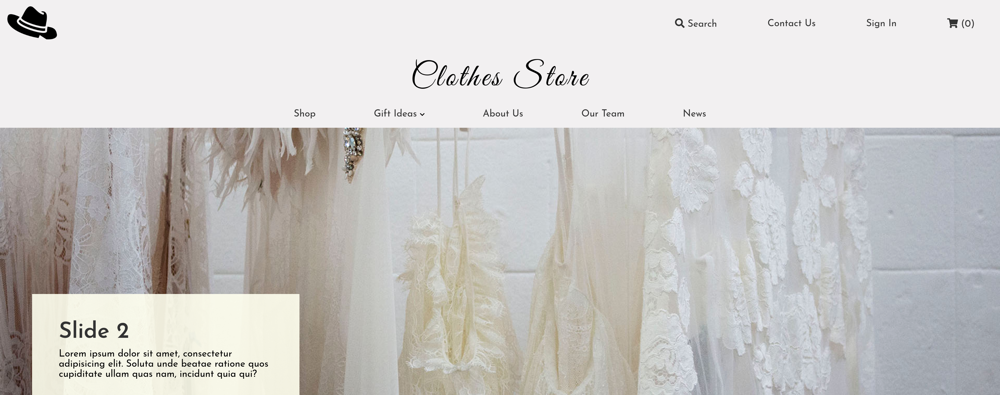
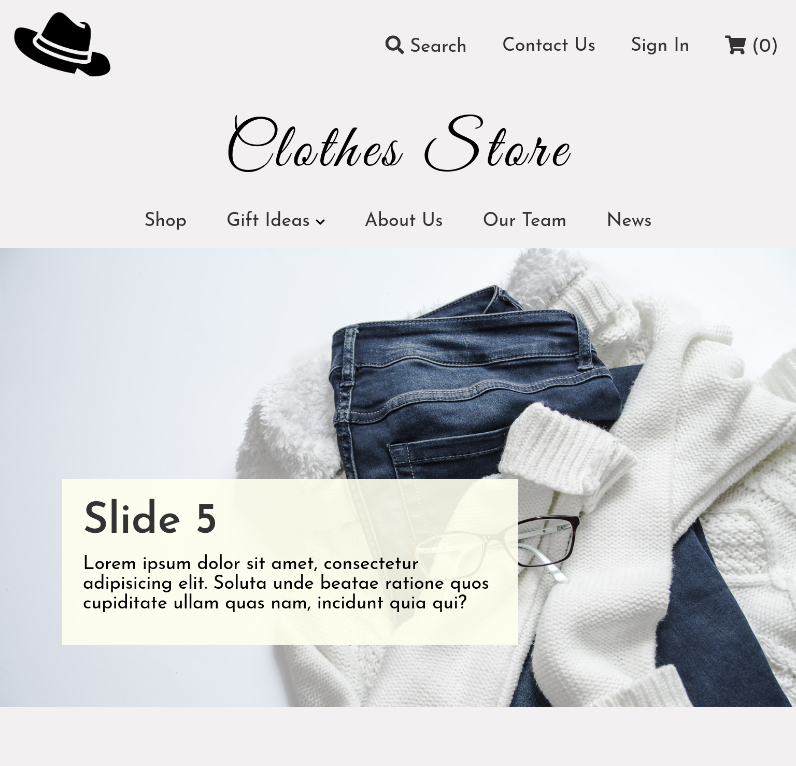

# 1. Primer Parcial Programación Web 02/2020

- [1. Primer Parcial Programación Web 02/2020](#1-primer-parcial-programación-web-022020)
- [2. Indicaciones:](#2-indicaciones)
- [3. Requerimientos](#3-requerimientos)
- [4. Entrega](#4-entrega)
- [5. Consideraciones](#5-consideraciones)
- [6. Criterios de evaluación](#6-criterios-de-evaluación)
- [7. Recursos](#7-recursos)
- [8. Notas](#8-notas)

# 2. Indicaciones:

Cree una página web para una tienda de ropa en linea utilizando HTML5, CSS3 y Sass.

# 3. Requerimientos

1. La página web de ser compatible con teléfonos, tablets y dispositivos de escritorio.
2. Debe utilizar la estructura de proyecto propuesta en las video clases.
3. El código Sass deberá estar altamente documentado mediante comentarios, en los que se espera la explicación del código. Ej.
  ~~~
  // File about-us

  /** 
   * Este archivo contiene las reglas CSS que personalizan el sección About Us del sitio web. 
   * La sección tomara un alto del 90% de viewport además se utiliza flex para distribuir 
   * el contenido en dos columnas.
   * La sección requiere tres breakpoints para obtener la compatibilidad con todos los tamaños
   * de pantalla, esto son:
   * 1300px, 900px, 800px
   **/
  .about-us {
    height: 90vh;
    display: flex;
    align-items: center;

    // Modificación de las dimensiones 
    @media (max-width: 900px) {
      min-height: 70vh;
      height: auto;
      padding: 1rem 0;
    }

    // Define el estilo de la columna izquierda
    &-left {
      width: 40%;
      // Permite desplazar la columna hacia la izquierda
      position: relative; 
      // Se desplaza para hacia la izquierda para mostrar solamente una sección de la imagen
      left: -200px; 

      @media (max-width: 1300px) {
        left: -150px;
      }

      @media (max-width: 800px) {
        display: none; // Se oculta para tablets y teléfonos
      }

      // Obligamos a la imagen a tomar el tamaño del contenedor left
      img {
        width: 100%;
        opacity: 0.7;
      }
    }
  ~~~ 
4. La página debe verse como se muestra en las imágenes y videos siguientes: ( **Si tiene problemas de visualización del contenido consultar la carpeta anexos**)
   - Video explicativo y resultado esperado:
      !video[Resultado esperado](anexos/resultado_esperado.webm)
   - Diseño Escritorio:
      
   - Diseño teléfono:
      
   - Diseño tablets:
      
5. Debe utilizar el sistema de control de versiones Git, realizando commits por los menos en los siguiente momentos:
   - Creación de la estructura de proyecto
   - Agregar los recursos multimedia
   - Creación de estructura HTML para Header
   - Creación de estructura HTML para Slides
   - Creación de estructura HTML para Products
   - Creación de estructura HTML para Footer
   - Creación de estilo para Header
   - Creación de estilo para Slides
   - Creación de estilo para Products
   - Creación de estilo para Footer

# 4. Entrega

La entrega se realizara a traves del repositorio donde se encuentra este archivo, es decir, la actividad de GitHubClassRoom.
Dispondrá de un total de **2 horas** desde las **6:30 PM** del dia 22/SEPT/2020 hasta las **9:00 PM** del día 22/SEPT/2020.

# 5. Consideraciones

- El proyecto sera revisado en entorno Linux.
- Cualquier nivel de copia tendrá una calificación de 0.
- Cualquiera de las siguiente circunstancias se aplicara la nota de 2 (Solamente si hay entrega):
  - Si en la entrega existe un commit después de las 9:00 PM (>=09:00 PM).
  - Problemas con nombres de archivos: 
    - Imágenes no cargan.
    - CSS no conectado.
- La falta de tabulación o el indentado inadecuado restara un punto en cada criterio de evaluación.

# 6. Criterios de evaluación

Los siguientes criterios son solamente aplicable si en el proyecto se puede compilar los archivos Sass y la página se encuentra completamente estilizada. Recuerde que el objetivo de la evaluación es comprobar que la técnicas que utiliza para construir un producto completo.  

| Criterio                                                     | Ponderación | Obtenido | Observaciones |
| :----------------------------------------------------------- | :---------: | :------: | :-----------: |
| Estructura de Proyecto                                       |    05.0     |          |               |
| Uso de etiquetas HTML de contenido (a, h1, p ...)            |    05.0     |          |               |
| Uso de etiquetas HTML de contenedoras (section, div, nav ..) |    10.0     |          |               |
| Uso de atributos HTML (clases, types, id, rel, name,for)     |    10.0     |          |               |
| Uso de Selectores básicos (clases, id , etiqueta)            |    01.0     |          |               |
| Uso de Combinación de selectores (+, ~ , >)                  |    01.0     |          |               |
| Uso de Pseudo-elementos Pseudo-clases                        |    07.0     |          |               |
| Uso de Flex                                                  |    10.0     |          |               |
| Uso de Position (Absolute,Relative, left, right ...)         |    05.0     |          |               |
| Uso de animaciones                                           |    05.0     |          |               |
| Uso de Media Query                                           |    07.0     |          |               |
| Uso de Mixin en Sass                                         |    04.0     |          |               |
| Uso de Extends en Sass                                       |    03.0     |          |               |
| Uso de Partial en Sass (archivos separados)                  |    07.0     |          |               |
| Uso de comentarios explicativos                              |    20.0     |          |               |
| Implementación de Slides con CSS (Extra)                     |    30.0     |          |               |
| Total                                                        |  100 + 30   |          |               |

En los criterios mostrados anteriormente la palabra **Uso** hace referencia a la implementación técnica adecuada del concepto y no a la simple escritura de los elementos.

# 7. Recursos

Los siguientes enlaces son los recursos de imagen necesarios para crear el sitio. Estos se podrán descargar hasta las 11:00 PM 22/SEPT/2020.

- https://i.ibb.co/5vKwH0q/img1.jpg
- https://i.ibb.co/k2R5921/img2.jpg
- https://i.ibb.co/qD0QhZx/img3.jpg
- https://i.ibb.co/j4BTsZB/img4.jpg
- https://i.ibb.co/HtxWgLT/img5.jpg
- https://i.ibb.co/vY7X5kj/logo.png
- https://i.ibb.co/kXN8tH9/product1.png
- https://i.ibb.co/K5JPYZ2/product2.png
- https://i.ibb.co/VDxBbJR/product3.png

# 8. Notas

El proyecto incluye un archivo .gitignore que evita que suban los archivos CSS generado.
En el momento de la revision se ejecutara el comando 
~~~ 
node-sass -o css sass 
~~~